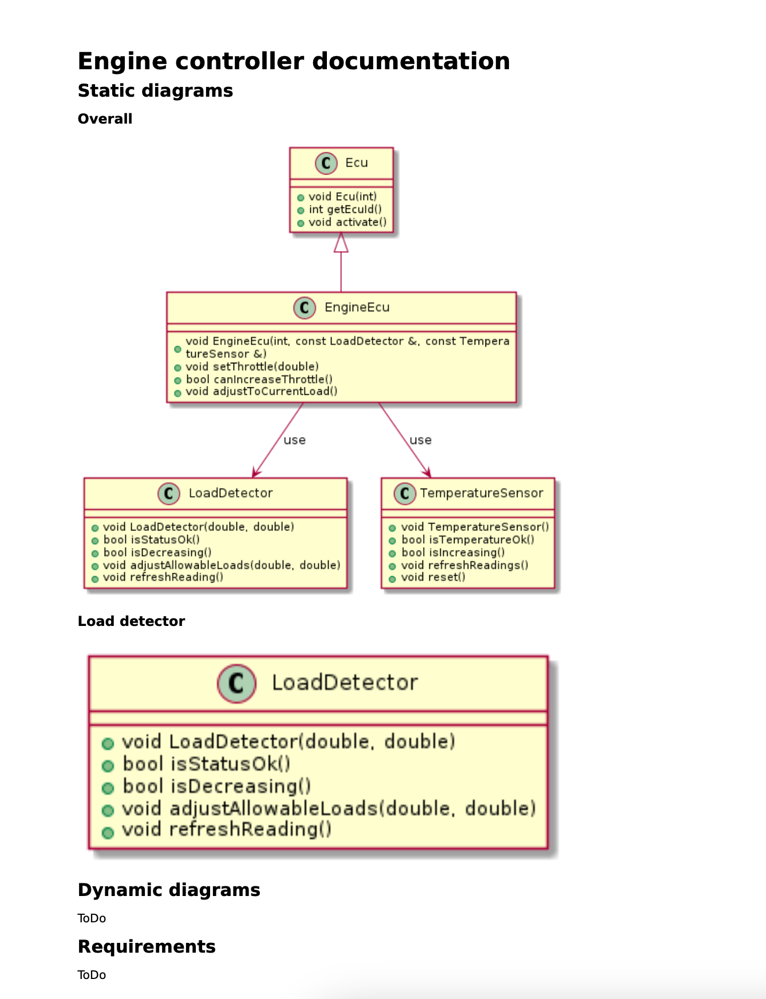

# diaggen

Your everyday V-model assistant for C++ projects!

## Purpose and objectives

Developing and delivering software in usually more than just programming. In some environments, certain level of formalism around documentation is also vital.
For example, safety-critical systems are usually built according to a so-called [V-model](https://insights.sei.cmu.edu/blog/using-v-models-for-testing/), with a 
very strong emphasis on design, testing and documentation. During SWE.3, one of the most cumbersome tasks which are usually done by the developers is preparation of the [software detailed design](https://www.mathworks.com/content/dam/mathworks/mathworks-dot-com/company/events/conferences/automotive-conference-stuttgart/2016/proceedings/software-detailed-design-for-model-based-development-obligatory-or-superfluous.pdf). Sometimes, it's particularly hard to design a proper set of software units up-front, hence the developer may re-implement a certain unit several times. Keeping the SDD up-to-date is problematic in such cases.

The idea of this particular project is to generate a set of necessary diagrams basing on the declaration and implementation of the classes forming a software component, **written in C++**. For starters, the tool should be capable of generating [class diagrams](https://www.ibm.com/docs/en/rsm/7.5.0?topic=structure-class-diagrams) of a component, as well as the [sequence diagrams](https://developer.ibm.com/articles/the-sequence-diagram/). The idea is to conveniently allow for injection of the diagrams into an SDD document.

## Installation & usage

Project heavily relies on [clang's intermediate representation](https://llvm.org/devmtg/2017-06/1-Davis-Chisnall-LLVM-2017.pdf) and how it allows us to access the program's meta-data when compiling. Python bindings for the clang's library have been prepared thus the project is written purely in python.

For now, the recommended way of using the application is through a docker container. For that purpose, please make sure you have [docker](https://www.docker.com/) installed and build the image first:

```
docker build --tag diaggen_image:1.0 .
docker run -it --volume /repo/root/diaggen/:/diaggen diaggen_image:1.0 /bin/bash
```

Then, to run the example, issue the following command:

```
cd diaggen
python3 -m diaggen --project-dir=/diaggen/example/engine_controller --doc=doc/detailed_design.md.in
```

In the example, the application injects the generated diagrams into a mark-down file template with special tokens:

```
# Engine controller documentation

## Static diagrams

### Overall

<!-- @diaggen-static@ --id=overall --ctx=api/engine_controller/load_detector.h --ctx-dir=api/engine_controller -->
<!-- @diaggen-static@ --id=overall --ctx-dir=api/engine_controller --includes=api -->

### Load detector

<!-- @diaggen-static@ --id=load_detector --ctx=api/engine_controller/load_detector.h -->
<!-- @diaggen-static@ --id=load_detector --ctx-dir=api/non_existent_dir -->

## Dynamic diagrams

ToDo

## Requirements

ToDo
```

The application will then produce a set of files, among which you can find the actual mark-down file with an accompanying PDF file with the desired text and diagrams:

```
example/engine_controller/doc
├── detailed_design.md
├── detailed_design.md.in
├── detailed_design.pdf
├── detailed_design_with_img.md
├── diagram0.png
├── diagram0.puml
├── diagram1.png
└── diagram1.puml
```

The final PDF will look similarly to this:

